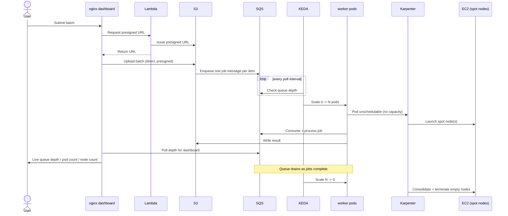
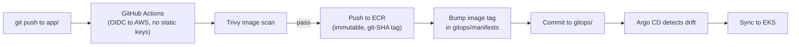

# EKS Event-Driven Autoscaling

An EKS showcase: an async job-processing pipeline whose autoscaling is the
visible product. Submit a batch → jobs hit SQS → worker pods scale **0→N** via
KEDA → Karpenter adds nodes when pods don't fit → a dashboard shows it live.

The full architecture, conventions, and build phases are documented in
[`CLAUDE.md`](CLAUDE.md) — that file is the source of truth; this README is
the quick-start.

## Stack

Terraform · EKS · Karpenter (nodes) · KEDA scale-to-zero + one HPA (pods) ·
IRSA (no static keys) · AWS Load Balancer Controller (ALB) · SQS/SNS · Lambda ·
Argo CD (GitOps) · GitHub Actions + OIDC + Trivy (CI/CD).

## Architecture

Full target design — what's actually deployed is marked **done**; everything
else is annotated with the phase that builds it (see Build status below).
For the network view specifically (ingress path, namespaces, subnets/CIDRs,
egress routes), see the
[network diagram](https://htmlpreview.github.io/?https://github.com/elveli/eks-event-driven-autoscaling/blob/main/docs/network-diagram.html)
(renders [docs/network-diagram.html](docs/network-diagram.html) via
htmlpreview.github.io — the file itself is self-contained if you'd rather
open it locally).


## Workflow

The two flows that make up "the demo": a user submitting a batch (runtime,
event-driven autoscaling) and a developer pushing code (CI/CD). Both are
target-state — phases 4–6 build the pieces these flows depend on.

**Submitting a batch — pods and nodes scale 0→N→0:**



**Pushing code — image build to GitOps sync:**



## Layout

```
.
├── .github/workflows/          infra.yml (plan/apply) + app.yml (build/scan/push)
├── app/
│   ├── lambda/                 request validator / presigned-URL issuer
│   ├── web/                    nginx + static dashboard
│   └── worker/                 job processor, scaled by KEDA on SQS depth
├── gitops/
│   ├── apps/                   Argo CD Application manifests
│   └── manifests/              Deployments, ScaledObject, Ingress, HPA
├── infra/
│   ├── bootstrap/              phase 1: state bucket + lock table (local state)
│   ├── environments/dev/       composes modules; backend + tfvars + on/off script
│   └── modules/
│       ├── network/            phase 2: VPC, subnets, single NAT, VPC endpoints
│       ├── cluster/            phase 3: EKS, OIDC, IRSA, Karpenter
│       ├── platform/            phase 4: LB Controller, KEDA, Argo CD (Helm)
│       └── app-resources/       phase 5: SQS, S3, Lambda, ECR, app IRSA
├── CLAUDE.md                   architecture decisions, build phases, conventions
└── README.md
```

Each module and app folder has its own `README.md` describing exactly what
goes in it.

## Build status

| Phase | What | Status |
|---|---|---|
| 1 | Bootstrap (state bucket + lock table) | ✅ applied |
| 2 | Network (VPC, single NAT, VPC endpoints) | ✅ applied |
| 3 | Cluster (EKS, OIDC/IRSA, Karpenter) | ✅ applied |
| 4 | Platform (LB Controller, KEDA, Argo CD) | ⏳ not started |
| 5 | App resources (SQS, S3, Lambda, ECR, app IRSA) | ⏳ not started |
| 6 | App + GitOps (worker, dashboard, ScaledObject) | ⏳ not started |

Continuing the build with Claude Code: open this folder, confirm it has read
`CLAUDE.md`, and ask it to implement the next phase's module per its TODOs and
README — fmt/validate/plan only, you apply. See `CLAUDE.md` > Build phases for
the full dependency order.

## Operating the dev stack

Everything in `infra/environments/dev` (currently: network + cluster) is
managed as one unit via the wrapper script, scoped to that directory only —
it never touches `infra/bootstrap`, so the state bucket and lock table stay up
between sessions:

```sh
cd infra/environments/dev
./manage-aws-dev-stack.sh plan      # review changes
./manage-aws-dev-stack.sh apply     # bring the stack up
./manage-aws-dev-stack.sh destroy   # tear it down (asks for confirmation)
```

### After applying: connecting to the cluster

```sh
aws eks update-kubeconfig --name eda-dev --region us-east-1
kubectl get nodes                 # the 2-node system group
kubectl get pods -n karpenter      # Karpenter controller running?
kubectl get nodepool,ec2nodeclass  # the default NodePool/EC2NodeClass
```

If `kubectl get pods -n karpenter` doesn't show a `Running` pod, or
`nodepool`/`ec2nodeclass` come back empty, the Helm release or manifests
likely hit the first-apply chicken-and-egg case described in
`infra/modules/cluster/README.md` — re-run `apply` once.

There's no workload to actually trigger node scaling yet — Karpenter only
acts on unschedulable pods, and the worker Deployment + KEDA ScaledObject
don't exist until Phase 6. Once those land, the end-to-end usage flow
(submit a batch → watch pods and nodes scale → drain back to zero) will be
documented here.

## Cost discipline

Running 24/7 is ~$130–210/mo. Use `manage-aws-dev-stack.sh apply`/`destroy` as
your on/off switch — tear down the cluster, NAT, and nodes between sessions;
keep only the bootstrap state bucket. Re-applying from code is part of the
demo (proves reproducibility).

## Guardrails already set

- `.claude/settings.json` lets Claude run read-only/plan commands freely but
  makes it **ask** before `apply`, `destroy`, `kubectl apply`, or `aws *`.
- `.claudeignore` / `.gitignore` keep state files and `*.tfvars` out of context
  and out of git.
