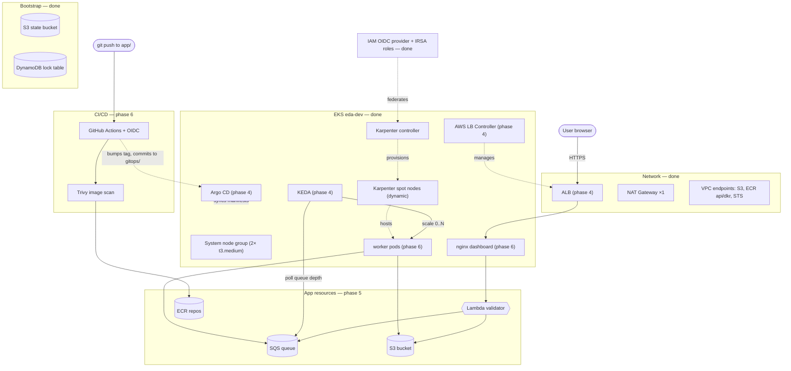
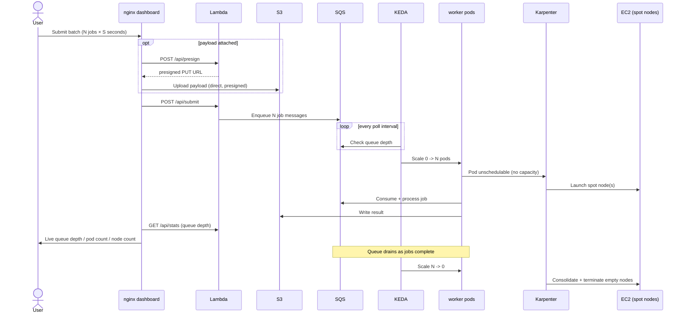
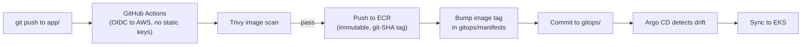

# EKS Event-Driven Autoscaling

An EKS showcase: an async job-processing pipeline whose autoscaling is the
visible product. Submit a batch → jobs hit SQS → worker pods scale **0→N** via
KEDA → Karpenter adds nodes when pods don't fit → a dashboard shows it live.

The full architecture, conventions, and build phases are documented in
[`CLAUDE.md`](CLAUDE.md) — that file is the source of truth; this README is
the quick-start.

## Contents

- [Stack](#stack)
- [Architecture](#architecture)
- [Workflow](#workflow)
- [Layout](#layout)
- [Build status](#build-status)
- [Operating the dev stack](#operating-the-dev-stack)
  - [Bring-up runbook](#bring-up-runbook)
  - [Driving the demo](#driving-the-demo)
  - [Make targets](#make-targets)
- [Cost discipline](#cost-discipline)
- [Guardrails already set](#guardrails-already-set)

## Stack

Terraform · EKS · Karpenter (nodes) · KEDA scale-to-zero + one HPA (pods) ·
IRSA (no static keys) · AWS Load Balancer Controller (ALB) · SQS + DLQ ·
Lambda · Argo CD (GitOps) · GitHub Actions + OIDC + Trivy (CI/CD).

## Architecture

Full target design — what's actually deployed is marked **done**; everything
else is annotated with the phase that builds it (see Build status below).
For the network view specifically (ingress path, namespaces, subnets/CIDRs,
egress routes), see the
[network diagram](https://htmlpreview.github.io/?https://github.com/elveli/eks-event-driven-autoscaling/blob/main/docs/network-diagram.html)
(renders [docs/network-diagram.html](docs/network-diagram.html) via
htmlpreview.github.io — the file itself is self-contained if you'd rather
open it locally).



## Workflow

The two flows that make up "the demo": a user submitting a batch (runtime,
event-driven autoscaling) and a developer pushing code (CI/CD). Both are
target-state — phases 4–6 build the pieces these flows depend on.

**Submitting a batch — pods and nodes scale 0→N→0:**



**Pushing code — image build to GitOps sync:**



## Layout

```
.
├── .github/workflows/          infra.yml (fmt/validate/plan) + app.yml (build/scan/push/bump)
├── Makefile                    wrappers for every command below (`make help`)
├── app/
│   ├── lambda/                 request validator / presigned-URL issuer
│   ├── web/                    nginx + dashboard + cluster-stats sidecar
│   └── worker/                 job processor, scaled by KEDA on SQS depth
├── gitops/
│   ├── apps/                   Argo CD Application manifests
│   └── manifests/              Deployments, ScaledObject, Ingress, HPA
├── infra/
│   ├── bootstrap/              phase 1: state bucket + lock table (local state)
│   ├── environments/dev/       composes modules; backend + tfvars + on/off script
│   └── modules/
│       ├── network/            phase 2: VPC, subnets, single NAT, VPC endpoints
│       ├── cluster/            phase 3: EKS, OIDC, IRSA, Karpenter
│       ├── platform/            phase 4: LB Controller, KEDA, Argo CD (Helm)
│       └── app-resources/       phase 5: SQS, S3, Lambda, ECR, app IRSA
├── CLAUDE.md                   architecture decisions, build phases, conventions
└── README.md
```

Each module and app folder has its own `README.md` describing exactly what
goes in it.

## Build status

| Phase | What | Status |
|---|---|---|
| 1 | Bootstrap (state bucket + lock table) | ✅ applied |
| 2 | Network (VPC, single NAT, VPC endpoints) | ✅ applied |
| 3 | Cluster (EKS, OIDC/IRSA, Karpenter) | ✅ applied |
| 4 | Platform (LB Controller, KEDA, Argo CD) | 🧩 code complete, plans clean — awaiting apply |
| 5 | App resources (SQS, S3, Lambda, ECR, app IRSA, CI OIDC) | 🧩 code complete, plans clean — awaiting apply |
| 6 | App + GitOps (worker, dashboard, ScaledObject, CI) | 🧩 code complete — awaiting apply + first CI run |

All six phases are code complete. What remains is operational: apply, run CI
once to populate ECR, hand the manifests to Argo CD (the bring-up runbook
below), and verify the definition of done in `CLAUDE.md`.

## Operating the dev stack

Every command below has a `make` wrapper (run `make help` for the menu; each
target is also runnable by hand). The lifecycle targets go through
`infra/environments/dev/manage-aws-dev-stack.sh`, which is scoped to that
directory only — it never touches `infra/bootstrap`, so the state bucket and
lock table stay up between sessions.

### Bring-up runbook

Clean AWS account → running demo, in order:

```sh
make apply       # 1. terraform: VPC + EKS + Karpenter + platform + app resources (~20 min)
make kubeconfig  # 2. point kubectl at the cluster
make ci-var      # 3. give GitHub Actions the CI role ARN (repo variable AWS_ROLE_ARN)
make ci-run      # 4. build + Trivy-scan + push images, pin tags in gitops/ (watches the run)
make gitops      # 5. point Argo CD at gitops/manifests/ — one-time, it auto-syncs after this
make url         # 6. the dashboard's ALB address (takes ~2 min to provision)
```

Order matters at two points: CI needs the `eda-gha` role and ECR repos
(step 1) plus the `AWS_ROLE_ARN` variable (step 3) before it can push;
once Argo CD is pointed at the repo (step 5) it deploys whatever image tags
CI pinned in `gitops/manifests/kustomization.yaml` (step 4), so until CI has
run once there is nothing deployable.

If the first `apply` errors reaching the cluster (Karpenter Helm release /
NodePool manifests), that's the known first-apply chicken-and-egg case in
`infra/modules/cluster/README.md` — re-run `apply` once.

### Driving the demo

Open the dashboard (`make url`) and submit a batch — or from the terminal:

```sh
make submit N=100 DUR=20   # enqueue 100 jobs of ~20s each via the Lambda
make watch                 # queue depth, worker pods, nodes — live, every 2s
```

What you should see: queue depth jumps to 100 → KEDA scales the worker
0→20 (one pod per 5 queued jobs) → pods exceed spare capacity → Karpenter
launches spot node(s) → the queue drains → pods scale back to 0 → Karpenter
consolidates the empty nodes away. The dashboard shows all of it; so does
`make watch`.

Everything else worth poking at is in the [make targets](#make-targets) table
below.

### Make targets

`make help` prints this same menu in the terminal. Defaults for the
parameterized target: `make submit` enqueues `N=50` jobs of `DUR=15` seconds.

| Target | What it does |
|---|---|
| **Lifecycle** — via `manage-aws-dev-stack.sh`, never touches `infra/bootstrap` | |
| `make plan` | terraform plan |
| `make apply` | provision VPC + EKS + Karpenter + platform + app resources (~20 min) |
| `make destroy` | the cost kill switch: tear it all down (state bucket survives) |
| `make kubeconfig` | point kubectl at the cluster |
| **CI / GitOps bootstrap** — once per bring-up, in this order | |
| `make ci-var` | give GitHub Actions the CI role ARN (repo variable `AWS_ROLE_ARN`) |
| `make ci-run` | build + Trivy-scan + push images, pin tags in gitops/ (watches the run) |
| `make gitops` | one-time: creates the Argo CD Application resource pointing at `gitops/manifests/`, so it starts auto-syncing from git |
| **Driving the demo** | |
| `make url` | the dashboard's ALB address (empty until the LB controller provisions it) |
| `make submit N=100 DUR=20` | enqueue a batch straight at the Lambda |
| `make watch` | the whole story every 2s: queue depth, worker pods, nodes |
| `make stats` | queue depth as the dashboard sees it (via the Lambda) |
| **Poking at state** | |
| `make queue` | raw SQS attributes of the jobs queue |
| `make dlq` | anything in the dead-letter queue? (3 failed attempts land here) |
| `make purge` | drop every queued job (in-flight ones finish; pods then drain to 0) |
| `make results` | worker output objects in S3, newest last + total count |
| `make pods` | every pod in the cluster, with the node it runs on |
| `make nodes` | nodes with their provenance (system node group vs Karpenter) |
| `make nodegroups` | node capacity, both kinds: static system group + Karpenter pool/claims |
| `make scaling` | both autoscalers side by side: KEDA ScaledObject + plain HPA |
| `make logs-worker` | follow all worker logs (one JSON line per job event) |
| `make logs-lambda` | follow the front-door Lambda's logs |
| `make argocd` | Argo CD UI on localhost:8080 (prints the admin password) |
| `make irsa` | service accounts annotated with IAM roles — the AWS-access wiring |
| `make inventory` | leak check: `Project=eda` resources (cross-verified live, not just the tagging index) + controller-created orphans (after destroy: only the bootstrap pair) |

## Cost discipline

Running 24/7 is ~$130–210/mo. Use `make apply` / `make destroy` as your on/off
switch — tear down the cluster, NAT, and nodes between sessions; keep only the
bootstrap state bucket. Re-applying from code is part of the demo (proves
reproducibility). `make inventory` should list nothing after a destroy.

## Guardrails already set

- `.claude/settings.json` lets Claude run read-only/plan commands freely but
  makes it **ask** before `apply`, `destroy`, `kubectl apply`, or `aws *`.
- `.claudeignore` / `.gitignore` keep state files and `*.tfvars` out of context
  and out of git.
